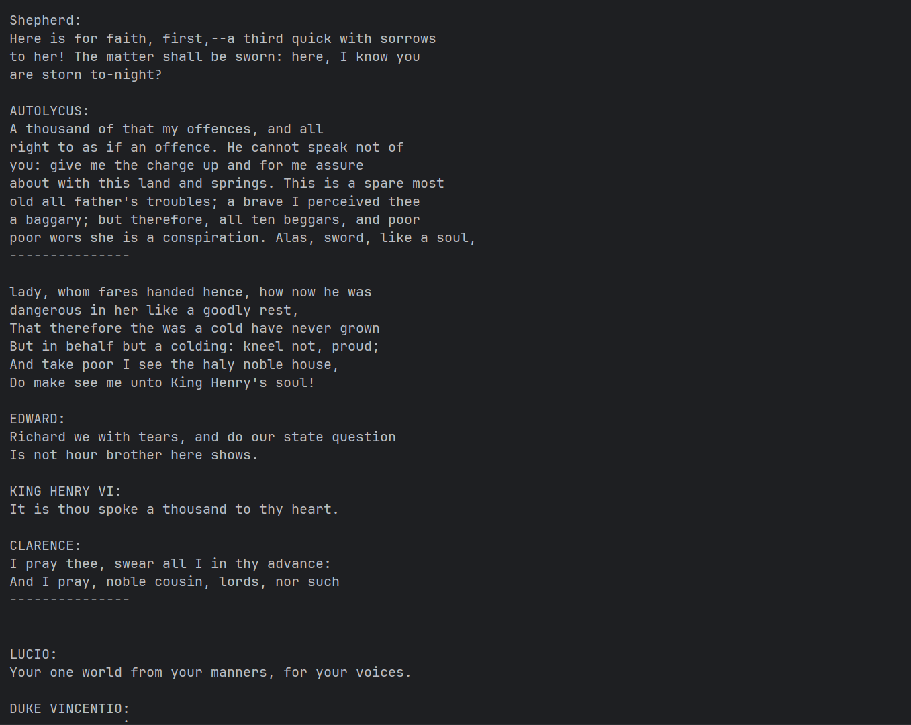
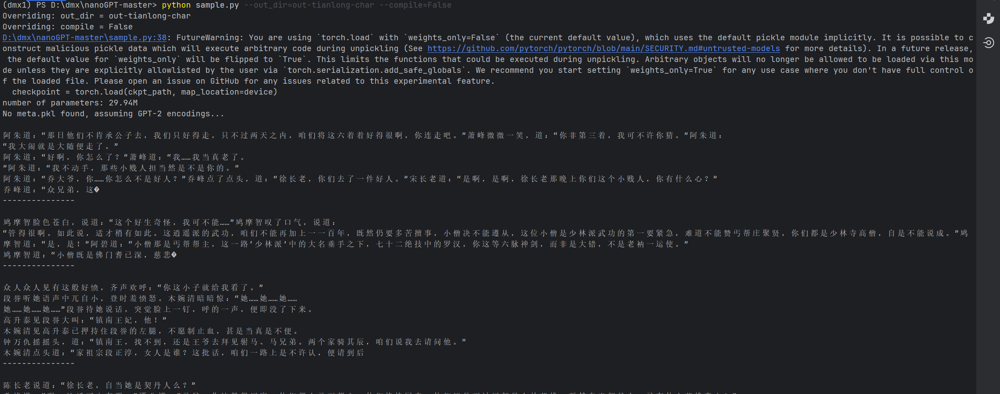
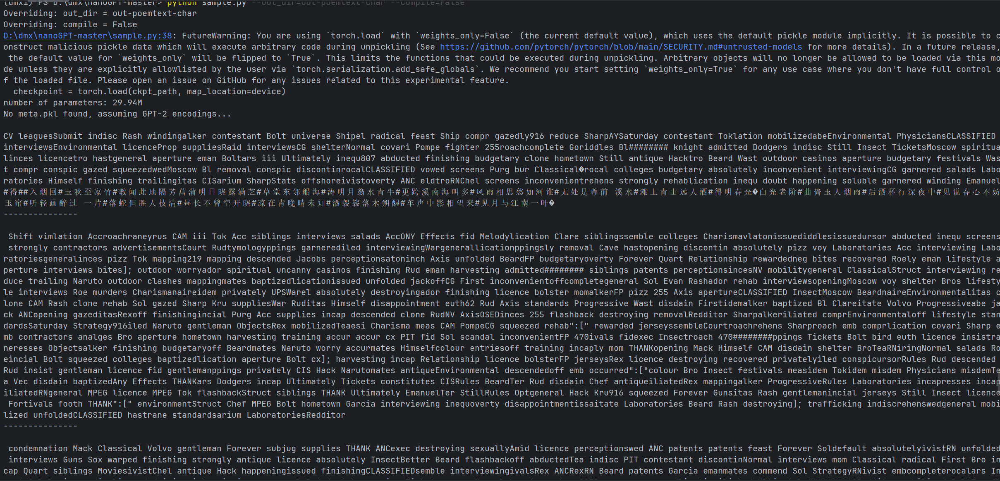

# nanoGPT
⽬前市⾯上⼤多数可⽤的GPT都⾮常的庞⼤，初学者很难学习和复现。nanoGPT项⽬[1]是使⽤Pytorch对GPT的⼀个复现， 包括训练和推理，其⽬的是做到⼩巧、⼲净、可解释性并且能⽤于教育。如果市⾯上的GPT模型是⼀艘“航空⺟ 舰”的话， nanoGPT可看做是⼀艘游艇，“⿇雀虽⼩，五张俱全”，对于初学者的⼊⻔学习有重要的意义。 本案例将训练三个模型：，一个是官方给的莎士比亚数据集，⼀个是使⽤由58000⾸诗词构成的诗歌数据集， 训练⼀个歌词⽣成的GPT；另⼀个是使⽤约 124万个字符构成的《天⻰⼋部》⽂本，训练⼀个具有《天⻰⼋部》⻛格的GPT。

## 安装

```
pip install torch numpy transformers datasets tiktoken wandb tqdm
```

- [pytorch](https://pytorch.org) <3
- [numpy](https://numpy.org/install/) <3
-  `transformers` for huggingface transformers <3 (to load GPT-2 checkpoints)
-  `datasets` for huggingface datasets <3 (if you want to download + preprocess OpenWebText)
-  `tiktoken` for OpenAI's fast BPE code <3
-  `wandb` for optional logging <3
-  `tqdm` for progress bars <3

## 步骤


```sh
python data/shakespeare_char/prepare.py
```

生成`train.bin` 和 `val.bin` 

```sh
python train.py config/train_shakespeare_char.py
```

然后从最佳模型中抽样

```sh
python sample.py --out_dir=out-shakespeare-char
```

生成如下样本


仿照莎士比亚的流程，在data里分别创建tianlong和poemtxt文件夹，将shakespeare_char中的prepare.py文件分别复制，并修改其中的路径，仿照上方命令运行生成训练集与测试集生成如下样本
   


思考题：
1. 使⽤《天⻰⼋部》tianlong.txt数据集训练⼀个GPT模型，并⽣成内容看看效果。  

2. 思考config/train_poemtext_char.py训练⽂件中其他参数的含义，修改其参数并重新进⾏训练，看看其效果怎么样。  
batch_size 每次迭代送入模型的样本数量。 增大可加速训练（充分利用 GPU），但受显存限制。若显存不足，需减小。  
block_size 输入序列的长度（上下文窗口大小）。 增大能让模型看到更长依赖，但会增加计算量和显存消耗。对于长篇小说，建议设 256 或 512。  
max_iters 最大训练迭代步数。增加可让模型充分收敛，但可能过拟合。可观察验证损失停止下降时提前停止。  
learning_rate 学习率。 太大导致训练不稳定，太小收敛慢。常见初始值 3e-4 左右，可尝试 1e-3 或 1e-4 观察损失曲线。  
n_embd 词嵌入的维度。 增大可提高模型容量，捕捉更丰富特征，但参数量增加，需更多数据和计算。  
n_head 多头注意力中头的数量。通常随 n_embd 增加而增加，保持每个头的维度（n_embd // n_head）合理。  
n_layer Transformer 的层数。 加深网络能学习更复杂模式，但更易过拟合且训练更慢。对于千万字级语料，6-12 层可能合适。  
dropout Dropout 概率，用于防止过拟合。训练集较小或模型较大时可适当提高（如0.2），一般设为 0.1~0.2。  
eval_interval 每多少步在验证集上计算损失并输出。 调小可更频繁监控训练，但会稍慢。  
grad_clip 梯度裁剪阈值，防止梯度爆炸。 保持默认 1.0 通常足够，若训练不稳定可适当减小。  
device 训练设备（cuda / cpu）。 有 GPU 务必设为 cuda，否则极慢。  
3. 研究模型采样⽂件sample.py，思考模型的推理过程是怎么样的？  
从训练输出目录（如 out-tianlong）加载训练好的模型参数。  
同时加载 meta.pkl 获得字符映射表 itos（索引→字符）和 stoi（字符→索引）。  
若用户提供了 --start 参数（如“萧峰”），则将其编码为整数列表，作为生成的起始上下文。  
若未提供，通常从一个特殊开始符（如 '\n'）或随机选择一个字符开始。  
将当前上下文（整数列表）输入模型，得到下一个字符的 logits（形状为 (1, 上下文长度, 词汇表大小)），通常只取最后一个位置的 logits。  
对 logits 进行处理：  
可除以 temperature（温度参数）控制概率分布的平滑程度（温度越高，越随机；温度越低，越倾向于高概率词）。  
可进行 topk 或 topp 截断，只保留概率最高的 k 个或累积概率超过 p 的候选，再重新归一化。  
从处理后的概率分布中采样一个索引  
将新字符的索引添加到上下文末尾，若上下文超过 block_size，则丢弃最前面的字符，保持固定长度。  
重复上述步骤，直到生成指定长度的文本或遇到结束符（如果有）。  
将生成的整数序列通过 itos 映射回字符，拼接成字符串并打印或保存。  

